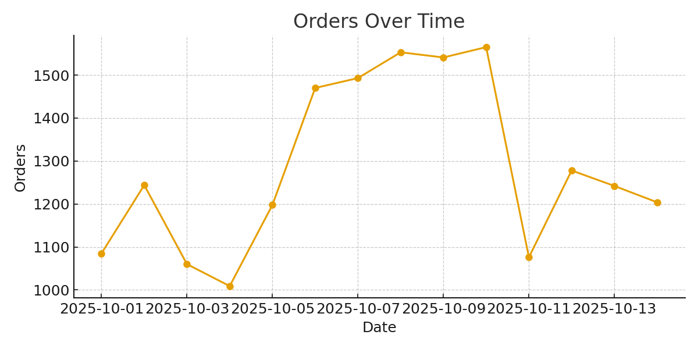
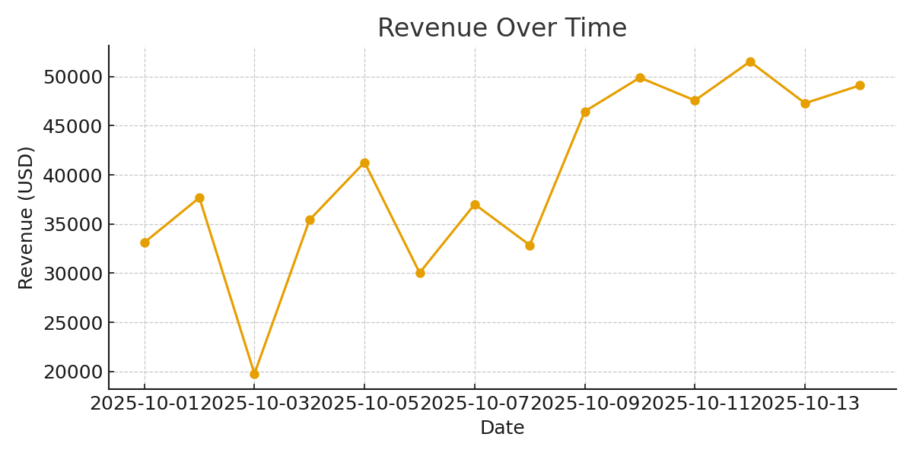

#  Real-Time Retail Data Streaming Platform

A production-grade real-time retail data pipeline built using **Apache Kafka, Spark Structured Streaming, Delta Lake, Snowflake, and Airflow**.  
This project simulates a retail company's end-to-end data flow — from live transaction ingestion to data warehousing and analytics — demonstrating a complete modern cloud-native data engineering pipeline.

---

## Architecture (Modern Data Lakehouse)

**Flow:** Mock Producer → Kafka → Spark Structured Streaming → Delta Lake (S3) → Snowflake → dbt + Airflow → BI Dashboard  

###  Architecture Diagram

Retail POS / E-Commerce Data
│
▼
Apache Kafka (Topics)
│
▼
Spark Structured Streaming
(Transform + Aggregate)
│
▼
Delta Lake (Bronze → Silver → Gold)
│
▼
Snowflake (Analytics Layer)
│
▼
Power BI / Tableau / Streamlit

 ##  Getting Started

###  1️ Clone the Repository

git clone https://github.com/DineshKyanam/Retail-streaming.git
cd Retail-streaming
### 2️ Start the Local Environment
Make sure you have Docker Desktop running, then start your local stack:

bash
Copy code
docker compose up -d
This starts Kafka, Spark, and Airflow services locally.

### 3 Generate Streaming Data
Run the mock data producer to continuously push transactions into Kafka:

bash
Copy code
python producer/produce_transactions.py
### 4️ Process Data with Spark
Run the real-time Spark streaming job:
spark-submit spark_streaming/stream_processor.py

### 5️ Monitor via Airflow
Access the Airflow UI at:
http://localhost:8080

Enable and trigger the DAG named retail_streaming_dag to orchestrate the ETL flow.

###  Sample Outputs
Below is a snapshot of daily retail KPIs produced by the streaming pipeline:

| date       | orders | revenue_usd | avg_order_value_usd | streaming_latency_ms |
|-------------|--------|--------------|----------------------|-----------------------|
| 2025-10-01  | 1023   | 34456.78     | 33.69                | 320                   |
| 2025-10-02  | 1289   | 45123.56     | 35.00                | 295                   |
| 2025-10-03  | 1411   | 49320.47     | 34.95                | 270                   |

 **Full Output:** [outputs/aggregates_daily.csv](outputs/aggregates_daily.csv)

### **KPI Dashboards**
### 1 Orders Over Time

### 2 Revenue Over Time

## Business Value

- Enables **real-time sales and revenue analytics**
- Delivers **sub-second latency metrics** for faster decisions
- Supports **fraud detection**, **dynamic pricing**, and **inventory optimization**
- Combines **streaming + batch processing** in a unified Lakehouse architecture
- Demonstrates **production-grade orchestration** using Airflow and dbt

## Future Enhancements

- Integrate **Kafka Connect** and **Schema Registry**
- Add **Grafana dashboards** for live monitoring
- Deploy to **AWS MSK + EMR + ECS** for cloud scalability
- Implement **CI/CD pipelines** for automated deployments
- Add **unit tests and alerting** for production reliability

## Author

**Dinesh Kyanam**  
 Overland Park, KS  
 [kyanamdinesh18@gmail.com](mailto:kyanamdinesh18@gmail.com)  
 [linkedin.com/in/dinesh-kyanam-180b611a2](https://linkedin.com/in/dinesh-kyanam-180b611a2)  
 [github.com/DineshKyanam](https://github.com/DineshKyanam)

